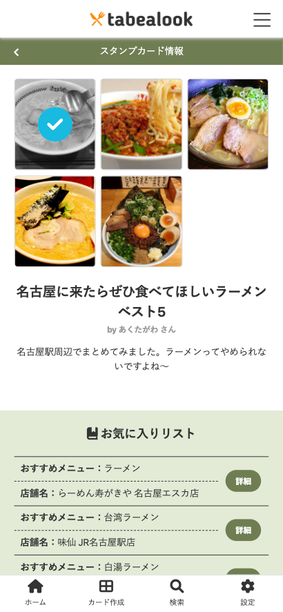

# アプリケーション名
tabealook（タベアルック）

# アプリケーション概要
おすすめの外食ごはん・スイーツなどを気軽にシェアし、 
ユーザー同士でコミュニケーションをとることができる。 
スタンプラリー形式にすることで、ゲーム感覚で楽しむことができる。

# URL
https://recorally.herokuapp.com/

# テスト用アカウント
<ul>
  <li>Basic認証ID：recorally</li>
  <li>Basic認証パスワード：37588</li>
  <li>カード作成者メールアドレス：test01@test.com</li>
  <li>カード作成者パスワード：test01</li>
  <li>プレイヤーメールアドレス：test02@test.com</li>
  <li>プレイヤーパスワード：test02</li>
</ul>

# 利用方法

## スタンプカードを作成する
1. トップページからユーザー新規登録を行う
2. カード作成ボタンから、共有したい情報を入力し作成する。
3. 必要に応じておすすめメニューを「メニュー追加」ボタンから追加する

## スタンプラリーを楽しむ
1. ホーム画面のスタンプカード一覧から、プレイしたいカードを選択する
2. 各おすすめメニューの「詳細」ボタンから、詳細ページに進む
3. お店を訪れおすすめメニューを食べたら「スタンプを押す」ボタンを押す

# アプリケーションを作成した背景
友人・知人との会話で、おすすめのご飯屋さんについての話題になった時に 
気軽に情報を共有できて、後で見てもわかりやすいアプリがあればいいと感じた。 
ただ情報を入れておくだけでなく、スタンプカード機能を取り入れることで 
ゲーム感覚で食べ歩きを楽しめるようにした。

# 洗い出した要件
[要件を定義したシート](https://docs.google.com/spreadsheets/d/1xp8unMI8xZ1gxdxHfx-YYX8BdA-iDF0M30uJ8dubrlw/edit#gid=1650945082)

# 実装した機能についての画像やGIFおよびその説明
## ホーム画面
  
## スタンプカード詳細ページ
  
## メニュー詳細ページ
  

# 実装予定の機能
<ul>
  <li>検索機能</li>
  <li>フォロー＆フォロワー機能</li>
  <li>いいね機能</li>
  <li>カードのカテゴリプルダウンをハッシュタグ入力方式に変更</li>
  <li>プライベートモード（非公開設定を追加、共有せず自分用に使いたい人へ）</li>
  <li>アバター画像、ヘッダー画像の削除機能</li>
  <li>PC版デザインの追加</li>
</ul>

# データベース設計

# 画面遷移図

# 開発環境
<ul>
  <li>フロントエンド：HTML/CSS</li>
  <li>バックエンド：Ruby/Ruby on Rails</li>
  <li>インフラ：MySQL</li>
  <li>テキストエディタ：Visual Studio Code</li>
  <li>タスク管理：GitHub</li>
</ul>

# ローカルでの動作方法
以下のコマンドを順に実行 
% git clone https://github.com/t-hoshino206/recorally.git 
% cd t-hoshino206/recorally 
% bundle install 
% yarn install

# 工夫したポイント
<ul>
  <li>スマホでの使用を想定し、実機プレビューを重ねて 
  押しやすいボタンサイズと読みやすいフォントサイズに調整した</li>
  <li>利便性を考えて、スポット情報にGoogle Mapのリンクを挿入できるようにした</li>
  <li>スタンプを押した達成感を表すために、訪問済みのメニュー画像にチェック処理を入れたり 
  ホーム画面のプロフィール欄に押したスタンプ数を挿入した</li>
</ul>